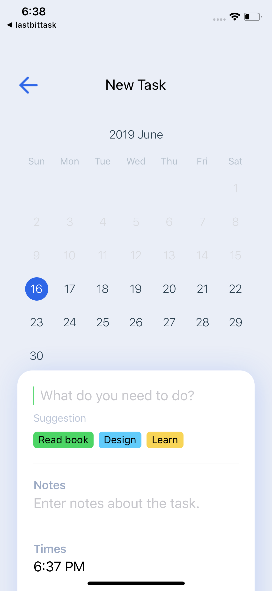

## Ứng dụng quản lý lịch cá nhân

Tính năng: Ứng dụng này sẽ giúp bạn kiểm soát các lịch trình của mình, từ đó nâng cao năng suất làm việc của mình.

- Phát triển dựa trên:  [expo](https://expo.io).

### Cài đặt

```
yarn install
```

## Video

<div align="center">
  <a href="https://www.youtube.com/watch?v=7hDTwq5HZOI&feature=youtu.be&ab_channel=TungNghia"></a>
</div>

### Ảnh chụp về ứng dụng

<p align="center">
  
  
  
  
  
</p>
